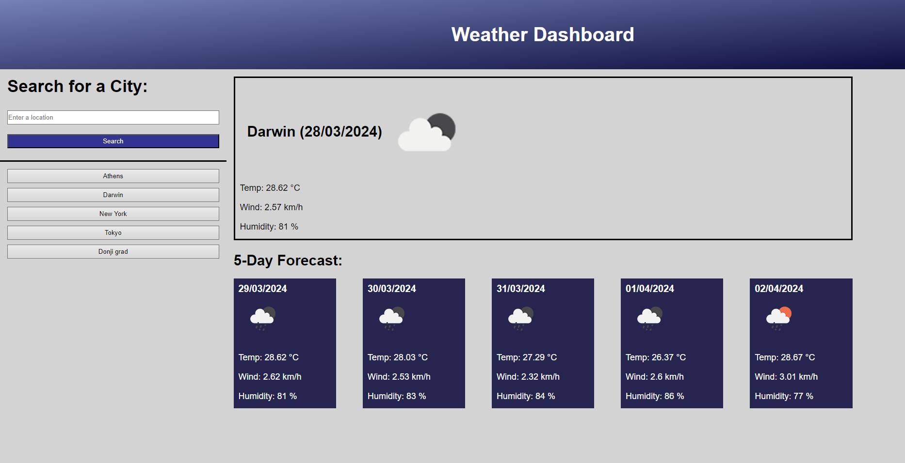

# Weather Dashboard

## Link & Contents
- [The Deployed Page](https://jiske-n.github.io/weather-dashboard/)
- [Further Goals](#further-goals)
- [Potential Issues/Improvements](#potential-issuesimprovements)
- [Key Learnings](#key-learnings)
- [Contributing and Feedback](#contributing-and-feedback)
- [Credits](#credits)
- [Licence](#licence)

## The Weather Dashboard

This page was designed for a user to be able to input locations and be able to see the current weather conditions as well as a 5 day forecast for that location. The user is then able to select previously searched locations to easily compare conditions between locations. Other features include:
- Saving the locations to local storage and generating quick access buttons to them.
- The use of a third party API to retrieve weather conditions.
- The use of dayjs to implement dates.

Goals included, having no error messages and using no bootstrap or jquery to refresh skills learnt earlier in the course.

- [The Deployed Page](https://jiske-n.github.io/weather-dashboard/)

## Further Goals

Other goals include:
-Writing a good README.
-Ensuring commenting is folowing best practices and in place for ease of future alteration.
-Have all elements of the page being semantic.

## Potential Issues/Improvements

- Condensing some of the code. For example replacing the section converting the first letter to capitalise with a function achieving the same.
- Setting the time of day for forecasts to reflect a set local time.
- Unsure if the balance for commenting is about right or too sparse/many.
- Trying to convert code to be uniform and follow best practice.
- Didn't follow the one hint in the task description about converting converting cities to coordinates instead of just a name because from what I can tell it works without, I might be missing something though.

## Key Learnings

The biggest learning points and hurdles I faced revolved around working out how different elements linked together.

Other learnings include:
- Manipulation of urls using template literal string.
- Use of query paramaters
- Hopefully, improved commenting.
- Use of fetch.

## Contributing and Feedback

If you find any issues or have contributions or feedback you can do so by opening an [issue](https://github.com/Jiske-N/weather-dashboard/issues) on Github.

## Credits

Starter code provided by edX/Monash University.

Made use of the Xpert learning assistant, AskBcs and my instructor with troubleshooting issues.

[OpenWeather](https://openweathermap.org) for providing the third party APIs used to retrieve weather.

## Licence

None presently. 
